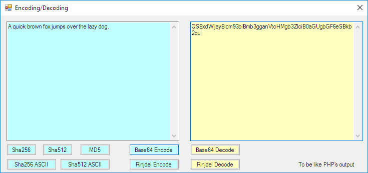

# hashing.cs

C# based data hasher. It provides simpler interface to access a particular hashing algorithm.
Outputs are expected to match that with PHP, MySQL and SQL Server.

It supports MD5, Base64 Encode, Base64 Decode, SHA256, SHA512.

## Usage Examples

### MD5
Output has to be equivalent to __php -r "echo hash('md5', 'A quick brown fox jumps over the lazy dog.');"__.

	hasher h = new hasher();
	string hash = h.md5("A quick brown fox jumps over the lazy dog.");

### Base64 Encode, Decode
Output has to be equivalent to __php -r "echo base64_encode('A quick brown fox jumps over the lazy dog.');"__.

	hasher h = new hasher();
	string hash = h.base64_encode("A quick brown fox jumps over the lazy dog.");
	string original = h.base64_decode("QSBxdWljayBicm93biBmb3gganVtcHMgb3ZlciB0aGUgbGF6eSBkb2cu");

### SHA256
Output has to be equivalent to __php -r "echo hash('sha256', 'A quick brown fox jumps over the lazy dog.');"__.

	hasher h = new hasher();
	string hash = h.sha256("A quick brown fox jumps over the lazy dog.");
	string hash = h.sha256ascii("A quick brown fox jumps over the lazy dog.");

### SHA512
Output has to be equivalent to __php -r "echo hash('sha512', 'A quick brown fox jumps over the lazy dog.');"__.

	hasher h = new hasher();
	string hash = h.sha512("A quick brown fox jumps over the lazy dog.");
	string hash = h.sha512ascii("A quick brown fox jumps over the lazy dog.");

## GUI

You can see the outputs on screen as well.
